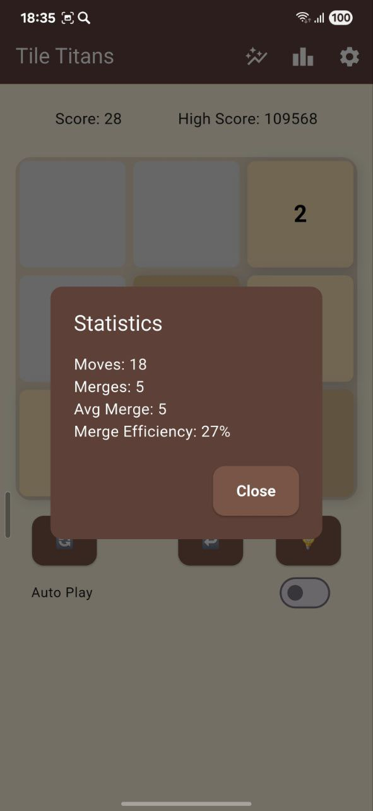

# 🎮 Tile Titans

_A retro-styled, addictive puzzle game built with Flutter. Swipe, merge, and conquer the grid!_


---

## 🕹️ About

Tile Titans is a nostalgic twist on the classic grid puzzle experience. Built in Flutter, it offers pixel-perfect styling, immersive themes, and multiple game modes — all wrapped in a retro arcade aesthetic. 

---

## ✨ Features

- 🧠 **Smart Modes**: Timed, Zen, Hardcore, Evil AI, and more
- 💡 **Hint System**: Smart AI recommends your next move
- 🤖 **Auto Play**: Let AI take over the grid
- 📈 **Leaderboard**: See where you rank globally
- 📊 **Stats Panel**: Track moves, merges, and efficiency
- 🌍 **Multilingual**: Supports EN, RU, ES, HY
- 🎨 **Themes**: Classic, Dark, Ocean, Retro, Neon
- 🔊 **Sound Effects**: Toggle sound for a more immersive experience
- ☁️ **Firebase Integration**: Auth, Realtime DB, Analytics, Crashlytics

---

## 🛠 Tech Stack

- Flutter & Dart
- Firebase (Auth, Database, Analytics, Crashlytics)
- Yandex Ads (Monetization)
- Provider (State management)
- Custom Theming and i18n

---

## 📲 Download Tile Titans

# 🚀 Download Now

<p float="left">
  <a href="https://play.google.com/store/apps/details?id=lets.play.game">
    
  </a>
  <a href="https://apps.apple.com/us/app/tile-titan/id6746075655">
    
  </a>
</p>

---

## 📲 Screenshots
# 📱 Phone Screenshots
# Android
<p float="left">
  
  
  
  
  
</p>

# iOS
<p float="left">
  
  
  
  
  
</p>

# 💻 Tablet Screenshots
# Android
<p float="left">
  
  
  
  
</p>

# iOS (iPad)
<p float="left">
  
  
  
  
</p>

---

## 🚀 Getting Started

```bash
git clone https://github.com/RobertTadevosyan/tile_titans.git
cd tile_titans
flutter pub get
flutter run
```

---

## 🌐 Web Build (Vercel)

Tile Titans can be deployed to Vercel:

```bash
flutter build web
# Push `build/web/` to Vercel or host - NOT READY YET
```

---

## 🛡 License 📄 

This project is licensed under the [MIT License](LICENSE).

---

## 💬 Feedback & Support

Have feedback or need support?  
Submit via [Google Form](https://docs.google.com/forms/d/e/1FAIpQLSf4uWDMGo7Uy6t9uIIQo5948Sa9lNH1nyEfC7n6rQi-Fi9XPg/viewform?usp=header) or email us at `robtdyn@gmail.com`

---

Enjoy the retro ride! 👾
